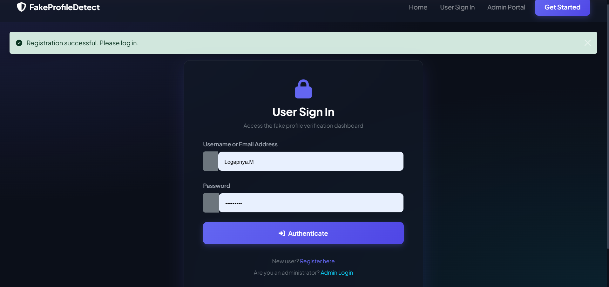
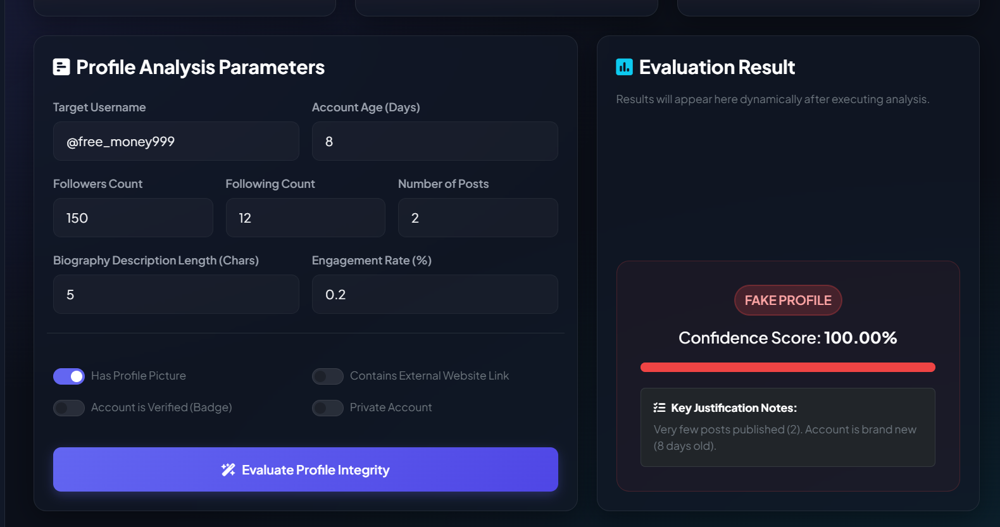
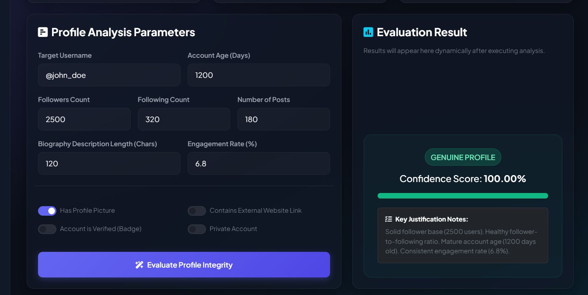
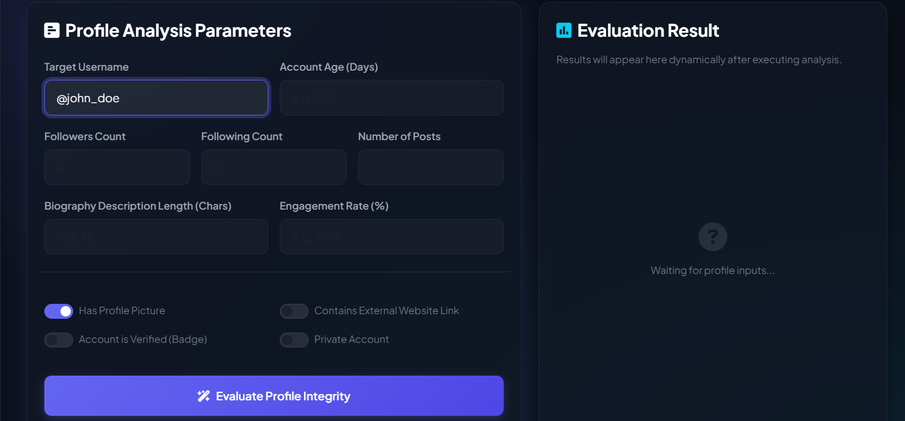
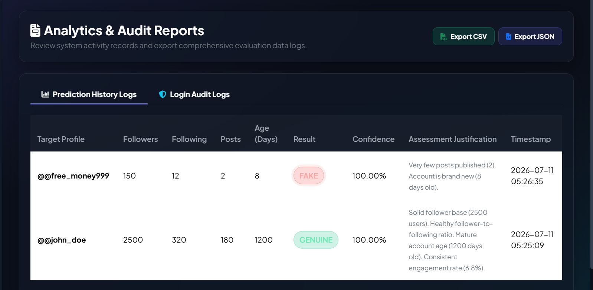
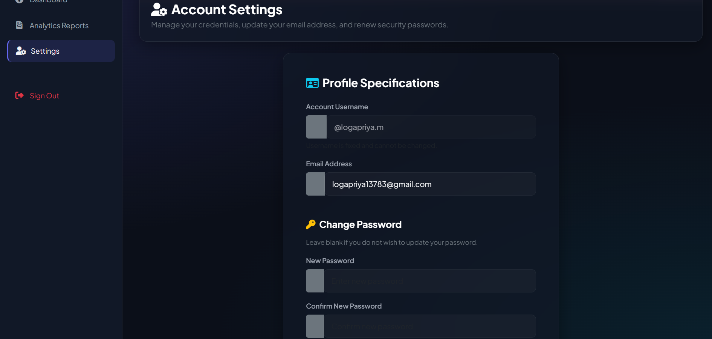

# Fake Profile Detection

An ML-powered web application that detects fake/bot social media profiles using machine learning, built with Python and Flask.

## 🌐 Live Demo

🚀 Try the live application here:

👉 [Fake Profile Detection System - Live Demo](https://fake-profile-detection-system-2.onrender.com/)

## 🚀 Features

- Machine learning model to classify social media profiles as **genuine** or **fake**
- Web interface built with Flask for easy interaction
- Trainable model pipeline using labeled social media profile data
- SQL database integration for storing profile data and predictions
- REST-style API endpoints for integration with other services
- Detailed project documentation included in the `docs/` folder

## 🛠️ Tech Stack

- **Backend:** Python, Flask
- **Machine Learning:** Python, scikit-learn, Random Forest Classifier
- **Database:** SQLite (`fake_profile.db`) with schema in `database.sql`
- **Frontend:** HTML, CSS, JavaScript (`templates/`, `static/`)
- **Data:** `social_media_profiles.csv`

## 📁 Project Structure

```
fake-profile-detection-system-/
├── app.py                     # Main Flask application
├── config.py                  # Configuration settings
├── train_model.py             # Script to train the ML model
├── database.sql                # Database schema
├── fake_profile.db             # SQLite database
├── requirements.txt            # Python dependencies
├── social_media_profiles.csv   # Dataset used for training
├── models/                     # Saved/trained ML models
├── static/
│   ├── css/                    # Stylesheets
│   └── js/                     # Client-side scripts
├── templates/                  # HTML templates
├── uploads/                    # Uploaded files/data
├── screenshots/                # App screenshots
└── docs/
    ├── api_documentation.md
    ├── deployment_guide.md
    ├── installation_guide.md
    ├── project_documentation.md
    ├── testing_report.md
    ├── user_manual.md
    └── diagrams/
```

## ⚙️ Installation

1. **Clone the repository**
   ```bash
   git clone https://github.com/<your-username>/fake-profile-detection-system-.git
   cd fake-profile-detection-system-
   ```

2. **Create a virtual environment** (recommended)
   ```bash
   python -m venv venv
   venv\Scripts\activate      # Windows
   source venv/bin/activate   # macOS/Linux
   ```

3. **Install dependencies**
   ```bash
   pip install -r requirements.txt
   ```

4. **Set up the database**
   ```bash
   # Run database.sql against your SQLite/DB setup, or let app.py initialize it
   ```

5. **Train the model** (if not already trained)
   ```bash
   python train_model.py
   ```

6. **Run the application**
   ```bash
   python app.py
   ```

7. Open your browser and go to `http://localhost:5000`

For detailed steps, see [`docs/installation_guide.md`](docs/installation_guide.md).

## 🧠 Usage

1. Launch the Flask app using `python app.py`
2. Upload or input social media profile data through the web interface
3. The trained ML model analyzes the profile and predicts whether it's **fake** or **genuine**
4. Results are displayed on the web page and optionally stored in the database

For full usage instructions, see [`docs/user_manual.md`](docs/user_manual.md).

## 🚀 Deployment

The application is deployed using Render. The Flask backend serves the web application and handles machine learning predictions, database operations, authentication, and report generation.

## 📊 Dataset

The model is trained using `social_media_profiles.csv`, which contains labeled profile data used to distinguish genuine accounts from fake/bot accounts.

## 📚 Documentation

Additional detailed documentation is available in the `docs/` folder:

| File | Description |
|------|-------------|
| `installation_guide.md` | Step-by-step setup instructions |
| `user_manual.md` | How to use the application |
| `api_documentation.md` | API endpoints and usage |
| `deployment_guide.md` | How to deploy the app to production |
| `project_documentation.md` | Full project overview and design |
| `testing_report.md` | Testing methodology and results |

## 🖼️ Screenshots

The application interface and prediction workflow are shown below.

### 🔐 User Login


### 📝 User Registration


### 📊 Dashboard


### 🕵️ Fake Profile Prediction


### ✅ Genuine Profile Prediction


### 🔍 Profile Analysis


### 📈 Analytics Dashboard


### ⚙️ Account Settings

> Update the image filenames above to match the actual files in your `screenshots/` folder.

## 📈 Results

The Random Forest Classifier model was trained and evaluated on the labeled `social_media_profiles.csv` dataset, achieving strong performance in distinguishing genuine profiles from fake/bot accounts. Key highlights:

- High accuracy in classifying fake vs. genuine profiles
- Detailed evaluation metrics (accuracy, precision, recall, F1-score) available in [`docs/testing_report.md`](docs/testing_report.md)
- Model performance validated through cross-validation on the training dataset

> Add your specific accuracy/precision/recall numbers here once finalized for a stronger, data-backed README.

## 🤝 Contributing

Contributions are welcome! Please fork the repository, create a feature branch, and submit a pull request.

## 📄 License

This project is licensed under the **MIT License** — see the [LICENSE](LICENSE) file for details.

## 👨‍💻 Author

**Logapriya M**

- **GitHub:** [LogapriyaMahendran](https://github.com/LogapriyaMahendran)
- **Project:** [Fake Profile Detection System](https://github.com/LogapriyaMahendran/fake-profile-detection-system-)
