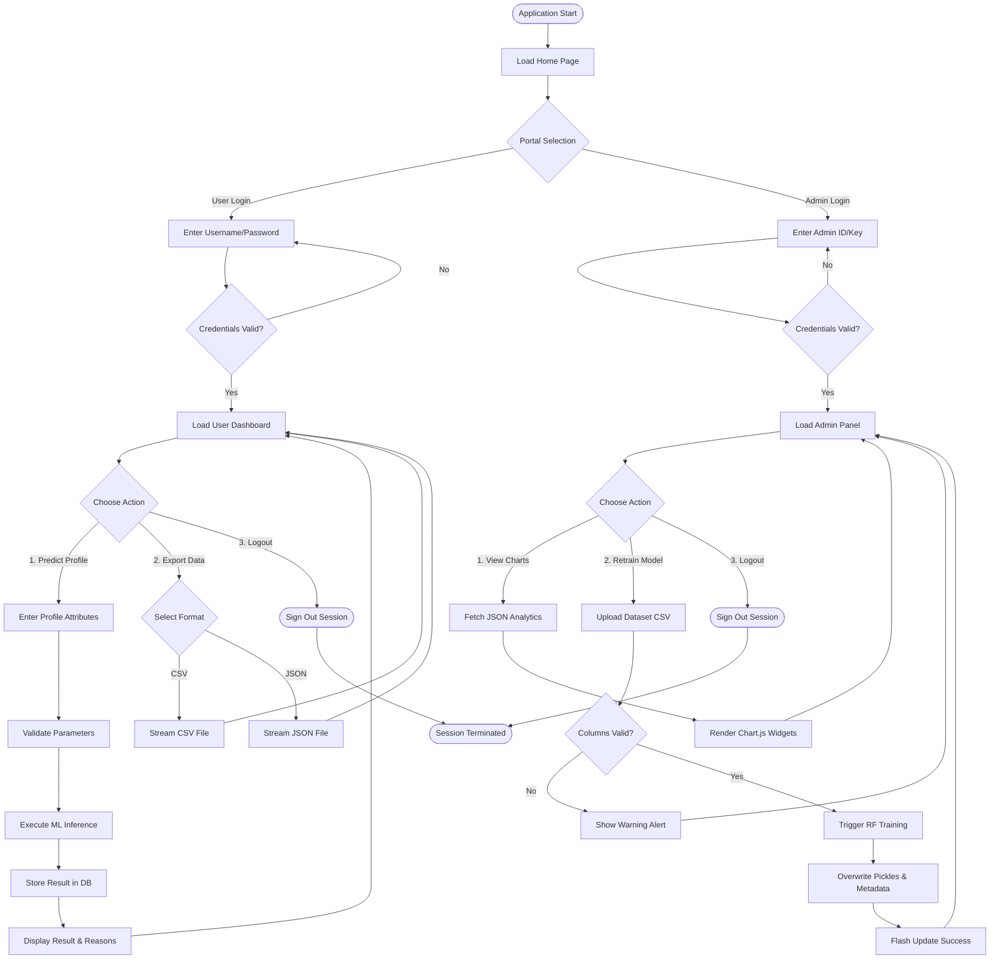

# Activity Diagram

This diagram displays the activity logic flows, decision nodes, and loops for user and admin actions.

```mermaid
flowchart TD
    Start([Application Start]) --> Landing[Load Home Page]
    Landing --> Choice{Portal Selection}
    
    %% User Flow
    Choice -->|User Login| UserForm[Enter Username/Password]
    UserForm --> UserAuth{Credentials Valid?}
    UserAuth -->|No| UserForm
    UserAuth -->|Yes| UserDash[Load User Dashboard]
    
    UserDash --> UserAct{Choose Action}
    UserAct -->|1. Predict Profile| InputForm[Enter Profile Attributes]
    InputForm --> Validate[Validate Parameters]
    Validate --> Inference[Execute ML Inference]
    Inference --> SaveDB[Store Result in DB]
    SaveDB --> ShowResult[Display Result & Reasons]
    ShowResult --> UserDash
    
    UserAct -->|2. Export Data| ChooseFormat{Select Format}
    ChooseFormat -->|CSV| ExCSV[Stream CSV File]
    ChooseFormat -->|JSON| ExJSON[Stream JSON File]
    ExCSV --> UserDash
    ExJSON --> UserDash
    
    UserAct -->|3. Logout| EndUser([Sign Out Session])
    
    %% Admin Flow
    Choice -->|Admin Login| AdminForm[Enter Admin ID/Key]
    AdminForm --> AdminAuth{Credentials Valid?}
    AdminAuth -->|No| AdminForm
    AdminAuth -->|Yes| AdminDash[Load Admin Panel]
    
    AdminDash --> AdminAct{Choose Action}
    AdminAct -->|1. View Charts| FetchAPI[Fetch JSON Analytics]
    FetchAPI --> Render[Render Chart.js Widgets]
    Render --> AdminDash
    
    AdminAct -->|2. Retrain Model| UploadCSV[Upload Dataset CSV]
    UploadCSV --> VerifyCols{Columns Valid?}
    VerifyCols -->|No| Reject[Show Warning Alert]
    VerifyCols -->|Yes| Retrain[Trigger RF Training]
    Retrain --> SaveModel[Overwrite Pickles & Metadata]
    SaveModel --> SuccessMsg[Flash Update Success]
    Reject --> AdminDash
    SuccessMsg --> AdminDash
    
    AdminAct -->|3. Logout| EndAdmin([Sign Out Session])

    EndUser --> Terminate([Session Terminated])
    EndAdmin --> Terminate
```
