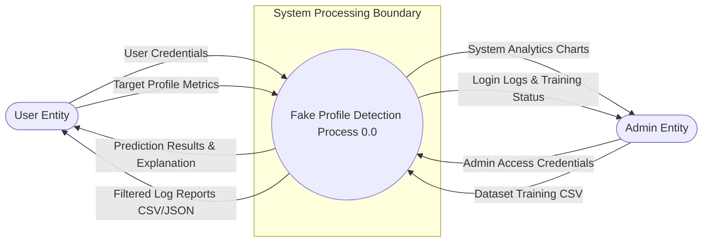

# Data Flow Diagram (DFD) - Level 0

The DFD Level 0 (Context Diagram) defines the high-level boundary interface, showing the information flows between the central system process and the external entities.

