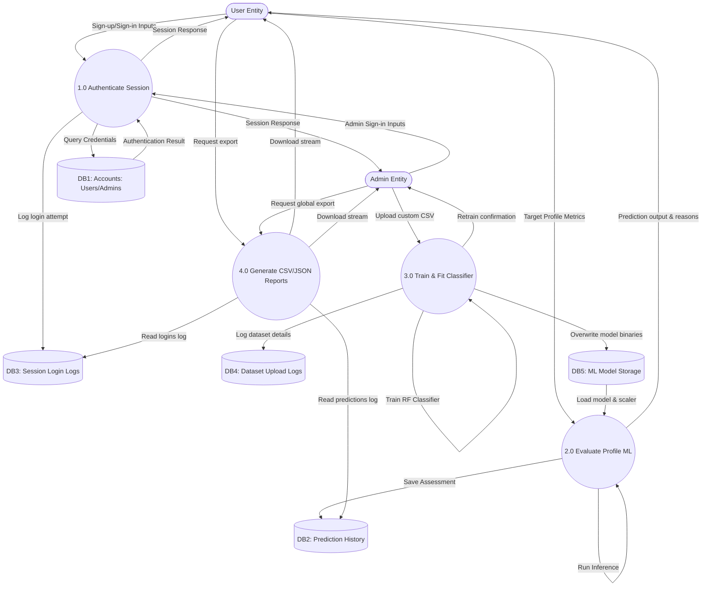

# Data Flow Diagram (DFD) - Level 1

The DFD Level 1 breaks down the parent context process into functional sub-processes, mapping their interactions with persistent database tables.

```mermaid
graph TD
    %% Entities
    User([User Entity])
    Admin([Admin Entity])
    
    %% Processes
    P1((1.0 Authenticate Session))
    P2((2.0 Evaluate Profile ML))
    P3((3.0 Train & Fit Classifier))
    P4((4.0 Generate CSV/JSON Reports))
    
    %% Datastores
    DS1[(DB1: Accounts: Users/Admins)]
    DS2[(DB2: Prediction History)]
    DS3[(DB3: Session Login Logs)]
    DS4[(DB4: Dataset Upload Logs)]
    DS5[(DB5: ML Model Storage)]
    
    %% Flow mapping for P1
    User -->|Sign-up/Sign-in Inputs| P1
    Admin -->|Admin Sign-in Inputs| P1
    P1 -->|Query Credentials| DS1
    DS1 -->|Authentication Result| P1
    P1 -->|Log login attempt| DS3
    P1 -->|Session Response| User
    P1 -->|Session Response| Admin
    
    %% Flow mapping for P2
    User -->|Target Profile Metrics| P2
    DS5 -->|Load model & scaler| P2
    P2 -->|Run Inference| P2
    P2 -->|Save Assessment| DS2
    P2 -->|Prediction output & reasons| User
    
    %% Flow mapping for P3
    Admin -->|Upload custom CSV| P3
    P3 -->|Train RF Classifier| P3
    P3 -->|Overwrite model binaries| DS5
    P3 -->|Log dataset details| DS4
    P3 -->|Retrain confirmation| Admin
    
    %% Flow mapping for P4
    User -->|Request export| P4
    Admin -->|Request global export| P4
    P4 -->|Read predictions log| DS2
    P4 -->|Read logins log| DS3
    P4 -->|Download stream| User
    P4 -->|Download stream| Admin
```
