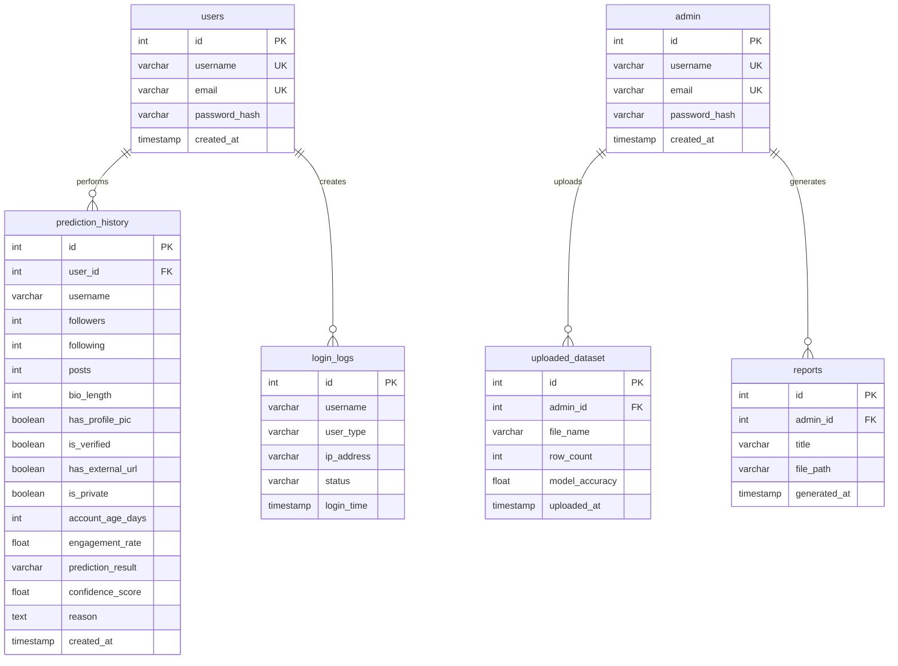

# Entity Relationship (ER) Diagram

This diagram displays the database entities, attribute types, keys, and relational cardinality rules.

```mermaid
erDiagram
    users ||--o{ prediction_history : "performs"
    users ||--o{ login_logs : "creates"
    admin ||--o{ uploaded_dataset : "uploads"
    admin ||--o{ reports : "generates"
    
    users {
        int id PK
        varchar username UK
        varchar email UK
        varchar password_hash
        timestamp created_at
    }
    
    admin {
        int id PK
        varchar username UK
        varchar email UK
        varchar password_hash
        timestamp created_at
    }
    
    prediction_history {
        int id PK
        int user_id FK
        varchar username
        int followers
        int following
        int posts
        int bio_length
        boolean has_profile_pic
        boolean is_verified
        boolean has_external_url
        boolean is_private
        int account_age_days
        float engagement_rate
        varchar prediction_result
        float confidence_score
        text reason
        timestamp created_at
    }
    
    uploaded_dataset {
        int id PK
        int admin_id FK
        varchar file_name
        int row_count
        float model_accuracy
        timestamp uploaded_at
    }
    
    reports {
        int id PK
        int admin_id FK
        varchar title
        varchar file_path
        timestamp generated_at
    }
    
    login_logs {
        int id PK
        varchar username
        varchar user_type
        varchar ip_address
        varchar status
        timestamp login_time
    }
```
