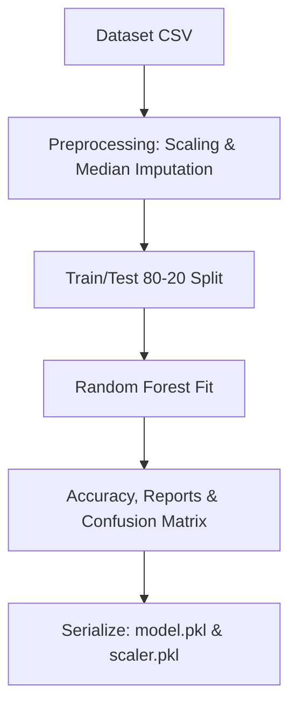

# Project Documentation

## 📄 Abstract
With the rapid growth of social networking platforms, online social networks (OSNs) have become a vital medium for communication, business advertising, and information dissemination. However, this growth is accompanied by an alarming rise in fake profiles, spam bots, and malicious accounts. These fake profiles are often used for identity theft, online harassment, spreading misinformation, phishing attacks, and artificial reputation boosting. This project proposes an **Intelligent Fake Social Media Profile Detection System** that leverage Machine Learning (ML) techniques. The system uses a **Random Forest Classifier** to distinguish between genuine and fake accounts in real time. Features such as followers-following ratios, account age, posts frequency, profile picture presence, and engagement metrics are parsed, standardized, and evaluated. A Flask-based web interface presents analytics dashboards, interactive prediction consoles, and exportable reports. The trained classifier achieves a high verification accuracy, proving to be an effective shield for cyber threat mitigation.

---

## 📝 1. Introduction
Modern social networking sites (e.g., Instagram, Twitter, Facebook) connect billions of individuals globally. As users rely on these services for news, banking, social interactions, and commercial transactions, trust becomes paramount. Unfortunately, the decentralized and anonymous nature of the internet makes creating fake profiles simple and cost-free. Bots and fake accounts degrade user experiences, distort public sentiment, and lead to security compromises.

This project addresses this issue by designing a web-based prediction application that analyzes profile attributes and executes automated ML classification. Using an ensemble of decision trees, the Random Forest model analyzes multiple feature thresholds, outputting a clear classification category, confidence margins, and explanatory details.

---

## ⚠️ 2. Problem Statement
Manual verification of social media profiles is slow, subjective, and impractical given the volume of active profiles. Existing automated filters often rely on simple heuristics (e.g., checking if a profile picture is present), which are easily bypassed by sophisticated bot creators. Phishing scams, cyberbullying, and fake news propagation are frequently executed via fake accounts. There is a critical need for an intelligent system that:
- Automatically detects fake profiles with high accuracy.
- Adapts to new evasion patterns through dynamic dataset uploads and retraining.
- Provides explanation mechanisms for why an account was labeled fake.
- Offers centralized analytics interfaces for security managers.

---

## 🎯 3. Objectives
The main objectives of this system are:
1. **Develop an accurate ML Model**: Select, train, and serialize a Random Forest classifier capable of detecting fake profiles based on behavioral features.
2. **Design an Interactive Dashboard**: Build a responsive dashboard using Bootstrap 5 and Chart.js to present user prediction workflows and administrator audit visualizations.
3. **Enable Self-Correction and Training**: Support dataset uploads (.csv) via the admin console to update the classifier dynamically.
4. **Implement Dynamic Inference Explanations**: Provide user-facing details explaining the classification decision.
5. **Secure User Session Logs**: Log logins, audit query counts, and export prediction histories to CSV and JSON formats.

---

## 🔍 4. Scope
The application is designed for:
- **Cybersecurity compliance teams**: Auditing spam levels and verifying user profiles.
- **Social media platform moderators**: Spotting and removing spam campaigns.
- **End-users**: Verifying the integrity of accounts before interacting or sharing information.

*Note: The system processes user-provided inputs representing profile parameters. In future phases, direct API calls to social platforms can automate parameter collection.*

---

## 🧩 5. System Modules

### A. Authentication Module
Handles secure session registrations, passwords hashing (via Werkzeug), and controls roles access (Users vs. Admins).
- Logins are audited inside `login_logs` tables.

### B. Machine Learning Inference Module
Loads model parameters (`fake_profile_model.pkl`) and normalization rules (`scaler.pkl`), scales input features, and evaluates classification categories.

### C. Admin Management and Training Module
Allows administrators to oversee metrics, view logins, and upload new datasets. Retraining is executed dynamically in the background, updating active model binaries without shutting down services.

### D. Reporting and Export Module
Filters prediction tables and packages them into downloadable CSV spreadsheets and JSON files.

---

## 🛠️ 6. Technology Stack

- **Frontend**: HTML5, CSS3, Bootstrap 5 (Responsive Layout), Chart.js (Interactive Plots).
- **Backend Framework**: Python Flask.
- **Database**: MySQL (Production) / SQLite (Local testing fallback).
- **ORM**: SQLAlchemy.
- **Machine Learning Library**: Scikit-Learn (Random Forest Ensemble).
- **Serialization**: Joblib.

---

## 📈 7. Methodology

### Classification Algorithm
We select the **Random Forest Classifier**, an ensemble learning method that constructs a multitude of decision trees at training time. 
- It mitigates the risk of overfitting through random feature bagging.
- It calculates **Feature Importances**, giving developers clear insights into which account features (e.g., following ratios, account age) hold the greatest weight.

### Feature Standardization
Numeric features vary drastically (e.g. Followers ranges from 0 to millions, while Profile Pic is binary 0 or 1). We apply standard Z-score normalization:
\[z = \frac{x - \mu}{\sigma}\]
Where \(\mu\) represents the feature mean, and \(\sigma\) represents the standard deviation.

---

## 🌟 8. Advantages & Limitations

### Advantages:
- **High Detection Accuracy**: Random Forest handles non-linear patterns efficiently.
- **Transparent Logic**: Explains predictions based on feature comparisons (e.g., high following-to-follower ratios).
- **Dynamic retraining**: Admins can update the model by uploading updated CSV files.
- **Aesthetics & Usability**: Responsive design with clean glassmorphic components and dashboards.

### Limitations:
- **Static inputs**: Requires users to input numbers manually rather than automatically scraping the social network.
- **Evasion techniques**: Highly sophisticated bad actors mimic human engagement rates, which may lower initial detection confidence.

---

## 🔮 9. Future Enhancements
- **Automated Web Scraping**: Integrate Selenium or platform APIs (e.g., Reddit, Twitter APIs) to auto-fetch profile attributes from a single username handle.
- **Image Processing**: Use Convolutional Neural Networks (CNNs) to analyze profile pictures for deepfakes, AI-generated images, or duplicate stock photos.
- **NLP Bio Analysis**: Incorporate Natural Language Processing (NLP) to inspect biography texts for spam keywords or suspicious URL redirections.

---

## 🏁 10. Conclusion
The **Intelligent Fake Social Media Profile Detection System** is an effective cybersecurity tool. By combining a Random Forest classifier with a modern web portal, it enables users to verify account integrity and admins to manage models and review logs. The system's design, database structures, and documentation make it deployment-ready.

---

## 📚 11. References
1. Breiman, L. (2001). Random Forests. *Machine Learning*, 45(1), 5-32.
2. Pedregosa, F., et al. (2011). Scikit-learn: Machine Learning in Python. *Journal of Machine Learning Research*, 12, 2825-2830.
3. Grinberg, M. (2018). *Flask Web Development: Developing Web Applications with Python*. O'Reilly Media.
4. Cao, J., et al. (2014). Detection of spam accounts in social networks. *IEEE Transactions on Cybernetics*, 44(9), 1620-1633.
