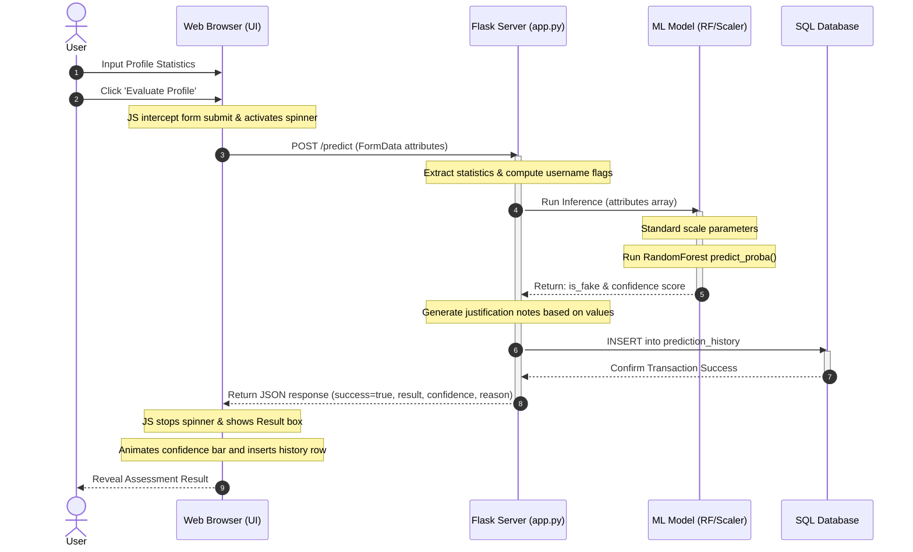

# Sequence Diagram

The sequence diagram details object communication interfaces and temporal sequences during a profile assessment cycle.

```mermaid
sequenceDiagram
    autonumber
    actor User
    participant UI as Web Browser (UI)
    participant Flask as Flask Server (app.py)
    participant ML as ML Model (RF/Scaler)
    participant DB as SQL Database

    User->>UI: Input Profile Statistics
    User->>UI: Click 'Evaluate Profile'
    Note over UI: JS intercept form submit & activates spinner
    UI->>Flask: POST /predict (FormData attributes)
    
    activate Flask
    Note over Flask: Extract statistics & compute username flags
    Flask->>ML: Run Inference (attributes array)
    
    activate ML
    Note over ML: Standard scale parameters
    Note over ML: Run RandomForest predict_proba()
    ML-->>Flask: Return: is_fake & confidence score
    deactivate ML
    
    Note over Flask: Generate justification notes based on values
    
    Flask->>DB: INSERT into prediction_history
    activate DB
    DB-->>Flask: Confirm Transaction Success
    deactivate DB
    
    Flask-->>UI: Return JSON response (success=true, result, confidence, reason)
    deactivate Flask
    
    Note over UI: JS stops spinner & shows Result box
    Note over UI: Animates confidence bar and inserts history row
    UI-->>User: Reveal Assessment Result
```
