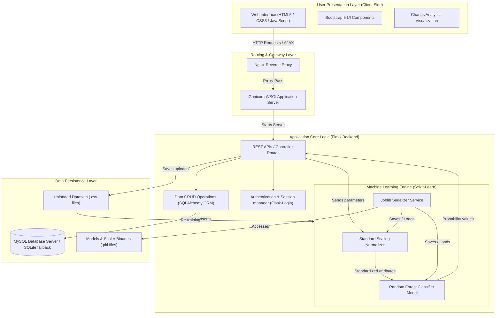

# System Architecture Diagram

This diagram outlines the multi-tiered system design, showing logical layer divisions from user interface down to physical files storage.

```mermaid
graph TD
    %% Layer Definitions
    subgraph ClientLayer["User Presentation Layer (Client Side)"]
        UI["Web Interface (HTML5 / CSS3 / JavaScript)"]
        BS["Bootstrap 5 UI Components"]
        ChartJS["Chart.js Analytics Visualization"]
    end
    
    subgraph GatewayLayer["Routing & Gateway Layer"]
        Nginx["Nginx Reverse Proxy"]
        Gunicorn["Gunicorn WSGI Application Server"]
    end
    
    subgraph AppLayer["Application Core Logic (Flask Backend)"]
        Auth["Authentication & Session manager (Flask-Login)"]
        CRUD["Data CRUD Operations (SQLAlchemy ORM)"]
        API["REST APIs / Controller Routes"]
        
        subgraph MLLayer["Machine Learning Engine (Scikit-Learn)"]
            Scaler["Standard Scaling Normalizer"]
            RF["Random Forest Classifier Model"]
            Joblib["Joblib Serializer Service"]
        end
    end
    
    subgraph PersistenceLayer["Data Persistence Layer"]
        DB[(MySQL Database Server / SQLite fallback)]
        FS["Models & Scaler Binaries (.pkl files)"]
        DS["Uploaded Datasets (.csv files)"]
    end

    %% Mappings
    UI -->|HTTP Requests / AJAX| Nginx
    Nginx -->|Proxy Pass| Gunicorn
    Gunicorn -->|Starts Server| API
    
    API --> Auth
    API --> CRUD
    CRUD -->|Queries / Inserts| DB
    
    API -->|Sends parameters| Scaler
    Scaler -->|Standardized attributes| RF
    RF -->|Probability values| API
    
    Joblib -->|Saves / Loads| RF
    Joblib -->|Saves / Loads| Scaler
    Joblib -->|Accesses| FS
    
    API -->|Saves uploads| DS
    DS -->|Re-training| MLLayer
```
